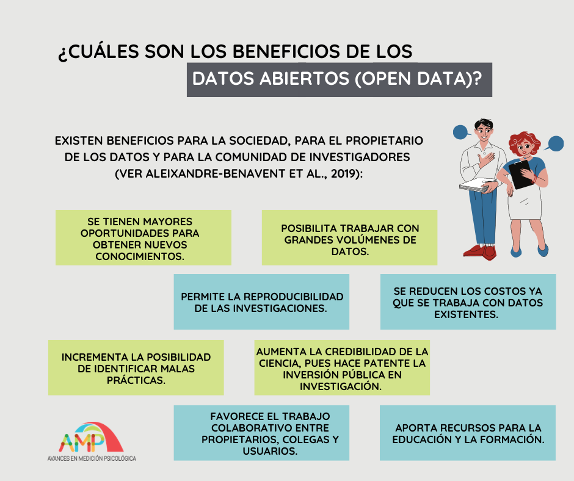

La transparencia y la reproducibilidad son características esenciales de la ciencia. Sin embargo, se han reportado prácticas cuestionables en investigación científica y se ha hecho visible la falta de una cultura de intercambio y acceso a la información. Frente a esto, en los últimos años, se ha propuesto la implementación de prácticas de ciencia abierta que permitan mejorar la calidad y credibilidad de la investigación. Debido a que algunas de estas prácticas han sido tomadas con escepticismo, Banks et al. (2018) explican algunas de las interrogantes más comunes sobre las prácticas de ciencia abierta. 

### **Panorama de la ciencia abierta**
#### *¿Qué es  ciencia abierta?*

La ciencia abierta es un término muy amplio que, aun cuando no existe consenso en cuanto a su definición y objetivos, abarca desde las filosofías científicas y las normas culturales hasta prácticas específicas. Algunos ejemplos de estas prácticas son: 

- Compartir datos y materiales usados en las investigaciones para mejorar la reproducibilidad.
- Efectuar estudios de replicación, para evaluar la generalizabilidad de los hallazgos científicos.
- Eliminar las barreras de pago, para aumentar el acceso al contenido científico.
- Cambiar los sistemas de incentivos para que los investigadores sean recompensados por promover un entorno de ciencia abierta. 

De esta forma, los cuatro aspectos fundamentales sobre los que se apoya la ciencia abierta en investigación incluyen al “conocimiento transparente”, “conocimiento accesible”, “conocimiento compartido” y “conocimiento de desarrollo colaborativo” (Vicente-Saez & Martinez-Fuentes, 2018). 

#### *¿Cuál es el objetivo principal de la ciencia abierta?*

El objetivo es mejorar el acceso, integridad y reproducibilidad de la investigación, lo cual permitiría reducir las prácticas de investigación cuestionables. 

#### *¿Qué beneficios tienen las prácticas de ciencia abierta?*

- Promueven una mayor colaboración, debido a que facilita una mejor comunicación entre investigadores con similares intereses. 
- Permiten compartir los protocolos de estudio e instrumentos que contribuyan al rigor de los diseños de investigación.
- Facilitan una mejor comprensión, revisión y desarrollo del proceso científico.
- Permiten una difusión más rápida y amplia de los resultados de los estudios.

### **Prueba de significancia de la hipótesis nula y ciencia abierta**
#### *¿Por qué tantas prácticas de ciencia abierta se centran en problemas del uso de la Prueba de significación de la hipótesis nula?*

Por mucho tiempo, se ha creído que la obtención de un p-valor estadísticamente significativo le otorga relevancia a una investigación. Por esto, los investigadores han optado por el “p-hacking”, práctica en la que se manipulan los datos hasta que se obtiene un resultado que permita rechazar la hipótesis nula. 
Esto podría mejorar si los investigadores (1) realizan el pre-registro, con las teorías, preguntas e hipótesis de investigación que soportan el estudio y se proporciona el conjunto de datos de las variables de estudio, y (2) brindan el conjunto de variables de estudio detallando cuáles se relacionan directamente con las hipótesis y cuáles se emplearán de manera más exploratoria. Otras posibles prácticas serían el uso del enfoque bayesiano y de machine learning. 

#### **Prácticas específicas de ciencia abierta**

Entre las principales prácticas de ciencia abierta se encuentran el pre-registro, y el acceso abierto a los datos y a los mismos artículos científicos. 

A) ¿Cuáles son los beneficios del pre-registro a un estudio?

Primero, el pre-registro del estudio consiste en que los investigadores registren las preguntas de investigación, hipótesis, diseño y plan de análisis a través de una organización independiente.

A través del pre-registro: 

- Expertos o profesionales podrían recomendar mejoras antes de la ejecución del estudio
- Se podría especificar los análisis confirmatorios y exploratorios de la investigación.
- Los revisores y editores estarían predispuestos a resultados de análisis exploratorios debido a la transparencia del proceso. 

B) ¿Cuáles son los beneficios de compartir los datos de un estudio? 
En la siguiente imagen se menciona por qué sería favorable realizarlo. 

### **Recursos relacionados con ciencia abierta**

Algunas de las herramientas más usadas para poner en práctica la ciencia abierta son Open Science Framework (OSF) y PsyArXiv. 
OSF es una página web que le permite a sus usuarios gestionar, almacenar y compartir el proceso como los archivos de su investigación o proyecto. En los siguientes artículos podrás encontrar tutoriales introductorios sobre cómo usarlos óptimamente: 

- Soderberg (2018) explica paso a paso cómo crear una cuenta, establecer un proyecto, subir archivos, compartir el proyecto con revisores y otras opciones.  
- Además, Sullivan et al. (2019) proporcionan una guía para registrar previamente un estudio, usar el control de versiones, compartir materiales de investigación y publicar un preprint.

PsyArXiv es un repositorio de preprints en acceso abierto de psicología y ciencias similares. Tengamos en cuenta que un preprint es la versión de un artículo antes de ser enviado a una revista científica. Por ejemplo, Crüwel et al. (2018) publicaron su manuscrito "7 Easy Steps to Open Science: An Annotated Reading List" en PsyArXiv. Además, compartieron los materiales que emplearon a través de OSF (osf.io/zwxrf/).

#### Referencias:

Banks, G. C., Field, J. G., Oswald, F. L., O’Boyle, E. H., Landis, R. S., Rupp, D. E., & Rogelberg, S. G. (2019). Answers to 18 questions about open science practices. *Journal of Business and Psychology*, *34*(3), 257-270. [https://doi.org/10.1007/s10869-018-9547-8](https://doi.org/10.1007/s10869-018-9547-8){target="_blank"}

Crüwell, S., van Doorn, J., Etz, A., Makel, M. C., Moshontz, H., Niebaum, J. C., Orben, A., Parsons, S., & Schulte-Mecklenbeck, M. (2018, November 16). 7 Easy Steps to Open Science: An Annotated Reading List. [https://doi.org/10.31234/osf.io/cfzyx](https://doi.org/10.31234/osf.io/cfzyx){target="_blank"}

Soderberg, C. (2018). Using OSF to share data: A step-by-step guide. Advances in Methods and Practices in Psychological Science, 1(1), 115-120. [https://doi.org/10.1177/2515245918757689](ttps://doi.org/10.1177/2515245918757689){target="_blank"}

Sullivan, I., DeHaven, A., & Mellor, D. (2019). Open and reproducible research on open science framework. *Current Protocols Essential Laboratory Techniques*, *18*(1), e32. [https://doi.org/10.1002/cpet.32](https://doi.org/10.1002/cpet.32){target="_blank"}

Vicente-Saez, R., & Martinez-Fuentes, C. (2018). Open Science now: A systematic literature review for an integrated definition. *Journal of Business Research*, *88*, 428–436. [https://doi.org/10.1016/j.jbusres.2017.12.043](https://doi.org/10.1016/j.jbusres.2017.12.043){target="_blank"}