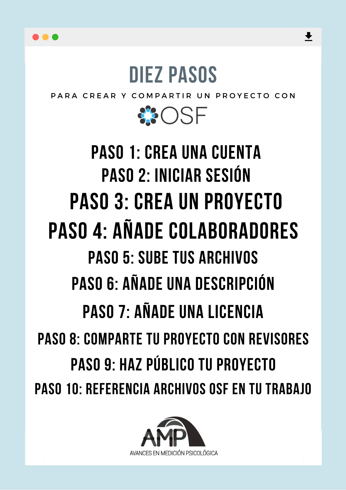

OSF es un repositorio web gratuito de acceso abierto, diseñada para ayudar a los investigadores a almacenar, administrar y compartir de manera colectiva su proceso de investigación y los archivos relacionados a su investigación (Soderberg, 2018). OSF también permite interactuar con los archivos durante el proceso de investigación, hacer pre registros de su trabajo y cargar pre prints si es necesario. Adicionalmente, OSF proporciona identificadores globales únicos (por ejemplo el DOI) para que los datos puedan ser citados y permite colocar descripciones a los datos para que estos sean más comprensibles y reutilizables. Por todo lo descrito, OSF responde a la necesidad de compartir materiales utilizados en investigación de manera que sean fácilmente encontrables, accesibles, interoperables y reutilizables, en concordancia con los principios propuestos por Wilkinson et al. (2016). Esto significa que facilita la reproducibilidad y la replicación al permitirla construcción de conocimiento con base a trabajos pasados y reutilización de datos antiguos para responder nuevas preguntas de investigación.

A continuación se presentará un breve tutorial elaborado por Soderberg (2018) sobre cómo crear un proyecto en OSF para almacenar y compartir archivos de investigación (data, scripts, documentos, etc.) al público. La mayoría de características y funcionalidades de OSF también pueden ser aprendidas en sus guías de ayuda de su página web [http://help.osf.io](http://help.osf.io){target="_blank"}.

**Paso 1: Crea una cuenta**

Para crear una cuenta nueva, entre a  [https://osf.io/](https://osf.io/){target="_blank"} y haga clic en el botón verde “Sign Up” en la esquina superior derecha de la pantalla. Complete sus datos para crear su cuenta y recibirá un correo electrónico para confirmar su cuenta. En caso pertenezca a una institución afiliada a OSF o cuente con ORCID, puede hacer clic en “institution" u “ORCID”.

**Paso 2: Iniciar sesión**

Una vez que tenga una cuenta, vaya a [https://osf.io/](https://osf.io/){target="_blank"} y haga clic en el botón azul "Get started". Luego, ingrese su nombre y contraseña para iniciar sesión. Si tiene la posibilidad, también puede ingresar con el botón "Sign up using ORCID/Institution".

**Paso 3: Crea un proyecto**

Para crear un nuevo espacio de trabajo en OSF, haga clic en el botón verde "Create new project". Un proyecto sobre OSF puede ser cualquier cosa: un experimento individual, una línea de investigación, un manuscrito, un grupo de laboratorio, etc. Escriba un título descriptivo para su proyecto en “Title”, luego haga clic en "Create" y en "Go to project" para acceder al espacio del proyecto.

**Paso 4: Añade colaboradores**

Los proyectos en OSF son privados de forma predeterminada, lo que significa que solo el creador de un proyecto puede acceder cuando se crea por primera vez. Puede dar acceso a colaboradores para que usen y actualicen los materiales, haga clic en "Contributors" en la barra de herramientas superior y luego en el botón verde "+ Add". Una vez dentro, puede añadir un colaborador al escribir su nombre de cuenta en OSF y hacer clic en el botón verde “+” al lado del resultado de búsqueda. Si su colaborador no aparece en la búsqueda, puede agregarlo al proyecto haciendo clic en "Add as an unregistered contributor" y redactando su correo electrónico. Esto permitirá al colaborador recibir una invitación para colaborar.

Después de agregar un colaborador, puede incluirlo en las referencias del proyecto marcando en el cuadro de la columna “Bibliographic Contributor” e indicar los permisos que tendrá en el proyecto. Finalmente, haga clic en "Add".

**Paso 5: Sube tus archivos**

OSF puede almacenar cualquier tipo de archivo; la única restricción es que un archivo individual no puede tener más de 5 GB. (Para archivos de más de 5 GB, los investigadores deben utilizar la función "Add-ons" que se encuentra en la barra de herramientas superior para conectar otro proveedor de almacenamiento, como Amazon S3, a su proyecto OSF). Para cargar archivos en el almacenamiento OSF, vaya a la página principal del proyecto y haga clic en “Files” en la barra de herramientas superior. Esto abrirá el almacenamiento del proyecto donde encontrará los botones verdes “+Create Folder” para crear carpetas y "Upload" para seleccionar los archivos que desea cargar en el proyecto.

**Paso 6: Añade una descripción**

Puede agregar una descripción para del proyecto facilita que usted y otros usuarios sepan con qué se relacionan los archivos con la función “Wiki” que se encuentra en la barra de herramientas superior. Esto lo llevará a la página de edición Wiki, donde puede incluir información sobre el proyecto, como un resumen, la cita del artículo con el que están asociados los archivos o una descripción escrita de los distintos archivos.

**Paso 7: Añade una licencia**

Debido a que la reutilización es uno de los propósitos principales del intercambio de datos, es importante que otros investigadores sepan cómo se les permite reutilizar su trabajo. Para que los datos se reutilicen de manera eficiente, deben estar disponibles bajo una licencia abierta. Aunque una descripción detallada de las posibles licencias está fuera del alcance de este tutorial, a menudo se recomienda una licencia CCO para los datos, porque es la licencia más permisiva y permite el dominio público del trabajo sin restricciones a la reutilización de los datos. Para agregar una licencia a un proyecto OSF, haga clic en "Add licence" (ubicado directamente encima de Wiki en la página de inicio del proyecto). La pantalla resultante le permitirá seleccionar varias licencias abiertas sugeridas, entre ellas la CCO 1.0 Universal.

**Paso 8: Comparte tu proyecto con revisores**

Ahora que su proyecto está configurado, es posible que desee o necesite dar acceso a los revisores al contenido de su proyecto antes de hacerlo público. Para hacer esto, haga clic en "Contributors" en la barra de herramientas, busque el encabezado "View-only Links" en la parte inferior de la página, y luego haga clic en el botón "+ Add". A continuación, puede asignar un nombre a su enlace y hacer clic en "Crear". Esto creará un enlace que le dará a cualquier persona que lo tenga acceso de sólo visualización a su proyecto mientras mantiene el proyecto inaccesible para cualquier persona que no tenga el enlace.

Si la revista a la que envía su manuscrito utiliza revisión de pares a ciegas, haga clic en la casilla "Anonymize" antes de crear el enlace. Al hacerlo, se eliminarán los nombres de los contribuyentes del proyecto OSF cuando se vea a través del enlace. Luego, puede incluir este enlace de solo lectura en su manuscrito enviado.

**Paso 9: Haz público tu proyecto**

Cuando esté listo para hacer público su proyecto, haga clic en el botón "Make Public" en la esquina superior derecha de la página del proyecto. Una vez que haya confirmado su elección, el proyecto será público y cualquiera podrá ver y descargar todos los archivos.

**Paso 10: Referencia archivos OSF en tu trabajo**

Las URL de todos los proyectos y archivos en OSF están formato GUID, lo que significa que las URL siempre apuntarán a hacía estos, incluso si mueve los archivos dentro de su proyecto o cambia el nombre de los archivos o proyecto. Es por eso que incluir estos enlaces en su artículo de investigación es una buena manera de asegurarse de que los lectores puedan encontrar los archivos de su proyecto a los que hace referencia. Además, se genera una cita automática del proyecto OSF y sus componentes en la zona desplegable “Cite” (a la derecha de la sección Wiki en la página del proyecto). Esta cita se puede incluir en las referencias de investigaciones, de modo que todos los contribuyentes reciban el crédito correspondiente cuando se reutilicen esos archivos.

#### Referencias

Soderberg, C. (2018). Using OSF to share data: A step-by-step guide. Advances in Methods and Practices in Psychological Science, *1*(1), 115-120. [https://doi.org/10.1177/2515245918757689](https://doi.org/10.1177/2515245918757689){target="_blank"}

Wilkinson, M. D., Dumontier, M., Aalbersberg, I. J., Appleton, G., Axton, M., Baak, A., Blomberg, N., Boiten, J. W., da Silva Santos, L. B., Bourne, P. E., Bouwman, J., Brookes, A. J., Clark, T., Crosas, M., Dillo, I., Dumon, O., Edmunds, S., Evelo, C. T., Finkers, R., Gonzalez-Beltran, A., … Mons, B. (2016). The FAIR Guiding Principles for scientific data management and stewardship. Scientific Data, *3*, 160018. [https://doi.org/10.1038/sdata.2016.18](https://doi.org/10.1038/sdata.2016.18){target="_blank"}

