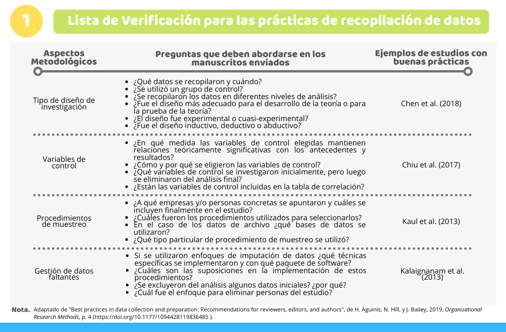
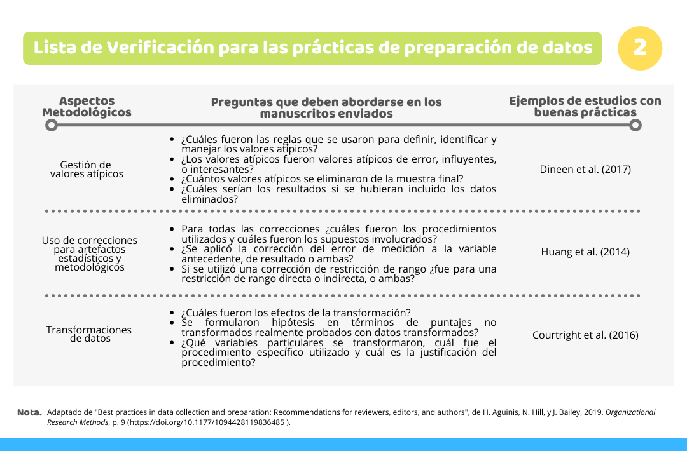

La [reproducibilidad](https://medicionpsicologica.com/2020/11/02/investigaci%C3%B3n-reproducible-en-la-ciencia/){target="_blank"} en la investigación ha sido considerada como un punto relevante en la ciencia; no obstante, en la práctica, esta atraviesa una crisis (Ballari, 2018). Puesto que, un gran porcentaje de investigadores (70% de 1500 científicos encuestados por Nature) ha comunicado que les resulta imposible o complicado reproducir los experimentos de otros científicos (Baker, 2016). Esto puede deberse a diversos factores, siendo uno de ellos: la insuficiente transparencia metodológica, la cual puede estar producida por la falta de conocimientos técnicos y motivación para ser transparente (Aguinis et al., 2019).

Tomando en consideración esta problemática, se han buscado medios para garantizar la transparencia metodológica en las investigaciones, permitiendo así la reproducibilidad de los resultados (obtener los mismos resultados haciendo uso de los datos del estudio original) y la reproducibilidad inferencial (llegar a conclusiones similares a las de los autores originales). Uno de los medios encontrados son las listas de verificación de reproducibilidad (Springer Nature, 2018). 

A partir de lo descrito anteriormente, el trabajo realizado por Aguinis et al. (2019) tiene como objetivo brindar una serie de recomendaciones, a través de listas de verificación, para aumentar la transparencia en relación con la recopilación y preparación de datos. Estas recomendaciones están dirigidas a revisores y editores, permitiéndoles mejorar la evaluación de las investigaciones y brindar observaciones más oportunas a los autores sobre qué podría mejorar, qué debería ser detallado para ser transparente y por qué es importante esto último. De tal manera que, se puedan abordar los aspectos motivacionales del autor para ser transparente. Así mismo, estas recomendaciones están dirigidas a los autores, pues por medio de la evaluación, los revisores y editores podrán dar consejos con respecto a los estudios futuros de los autores, abordando así, los conocimientos técnicos de estos. 

A continuación, se mencionan las recomendaciones propuestas por Aguinis et al. (2018) para las buenas prácticas metodológicas junto a una serie de estudios modelos o ejemplares, así como, una breve descripción de los temas o apartados que componen tanto a la recopilación y preparación de datos. 

##### Recopilación de datos
 
 
-	**Tipo de diseño de investigación**

Es fundamental desarrollar adecuadamente el diseño de investigación, ya que permitirá al investigador establecer los límites de su estudio, tener resultados más confiables y evitar conclusiones erróneas o incompletas (Labaree, 2021). 

- **Variables de control**

Estas variables permitirán prevenir o descartar la influencia de variables sospechosas en el estudio. Entre las variables de control está el uso de controles estadísticos. 

- **Procedimientos de muestreo**

El procedimiento para la selección de muestra es relevante en un estudio, porque brinda información sobre dos puntos en específicos: (a) la representatividad de las observaciones y (b) la generalización de los resultados y conclusiones. 

- **Gestión de datos faltantes**

Es probable que, durante el procedimiento de recolección, las bases de datos elaboradas incluyan datos faltantes. Por lo que, es importante saber cómo manejar estos datos faltantes y justificar los procedimientos que se vayan a utilizar para la gestión de estos. 

##### Preparación de datos
  
  
- **Gestión de valores atípicos**

Es importante identificar y gestionar los valores atípicos, puesto que estos pueden tener una gran influencia en el análisis, afectando los resultados y conclusiones.

- **Uso de correcciones para artefactos estadísticos y metodológicos**

La finalidad del uso de correcciones es aprender a ver cómo serían las puntuaciones y relaciones entre estas si las medidas obtenidas estuviesen libres de errores, como por ejemplo, error de medición, error de muestreo, etc. 

- **Transformación de datos**

El objetivo de la transformación es buscar normalizar las puntuaciones obtenidas. Así mismo, algunos investigadores hacen estas transformaciones para reducir la heterocedasticidad, cambiar las relaciones entre variables de multiplicativas a aditivas y promover la conveniencia analítica.

Por último, cabe mencionar que, si bien las listas de verificación presentadas pueden ser utilizadas tanto para fines evaluativos como de desarrollo, es importante tener en cuenta que estas no deben utilizarse de forma rígida para toda investigación empírica. Debido a que, estas son de carácter muy amplio y no necesariamente aplican para todos los campos, situaciones o estudios.

#### Referencias

Aguinis, H., Hill, N. S., & Bailey, J. R. (2019). Best practices in data collection and preparation: Recommendations for reviewers, editors, and authors. *Organizational Research Methods*, 1–16. [https://doi.org/10.1177/1094428119836485](https://doi.org/10.1177/1094428119836485){target="_blank"}

Baker, M. (2016). 1,500 scientists lift the lid on reproducibility. *Nature*, *533*, 452–454. [https://doi.org/10.1038/533452a](https://doi.org/10.1038/533452a){target="_blank"}

Ballari, D. (2018). Reproducibilidad científica: ¿Qué es y por qué debemos interesarnos en geo-ciencias? *Revista Cartográfica*, (97), 147–155. [https://doi.org/10.35424/rcarto.i97.179](https://doi.org/10.35424/rcarto.i97.179){target="_blank"}

Chen, J., Bamberger, P. A., Song, Y., & Vashdi, D. R. (2018). The effects of team reflexivity on psychological well-being in manufacturing teams. *Journal of Applied Psychology*, *103*, 443–462. [https://doi.org/10.1037/apl0000279](https://doi.org/10.1037/apl0000279){target="_blank"}

Chiu, C., Balkundi, P., & Weinberg, F. J. (2017). When managers become leaders: The role of manager network centralities, social power, and followers’ perception of leadership. *Leadership Quarterly*, *28*, 334–348. [https://doi.org/10.1016/j.leaqua.2016.05.004](https://doi.org/10.1016/j.leaqua.2016.05.004){target="_blank"}

Courtright, S. H., Gardner, R. G., Smith, T. A., Mccormick, B. W., & Colbert, A. E. (2016). My family made me do it: A cross-domain, self-regulatory perspective on antecedents to abusive supervision. *Academy of Management Journal*, *59*, 1630–1652. [https://doi.org/10.5465/amj.2013.1009](https://doi.org/10.5465/amj.2013.1009){target="_blank"}

Dineen, B. R., Duffy, M. K., Henle, C. A., & Kiyoung, L. (2017). Green by comparison: Deviant and normative transmutations of job search envy in a temporal context. *Academy of Management Journal*, *60*, 295–320. [https://journals.aom.org/doi/10.5465/amj.2014.0767](https://journals.aom.org/doi/10.5465/amj.2014.0767){target="_blank"}

Huang, J. L., Ryan, A. M., Zabel, K. L., & Palmer, A. (2014). Personality and adaptive performance at work: A meta-analytic investigation. *Journal of Applied Psychology*, *99*, 162–179. [https://doi.org/10.1037/a0034285](https://doi.org/10.1037/a0034285){target="_blank"}

Kalaignanam, K., Kushwaha, T.,M., Steenkamp, J. E., & Tuli, K. R. (2013). The effect of CRM outsourcing on shareholder value: A contingency perspective. *Management Science*, *59*, 748–769. [http://www.jstor.org/stable/23359513](http://www.jstor.org/stable/23359513){target="_blank"}

Kaul, A., Nary, P., & Singh, H. (2018). Who does private equity buy? Evidence on the role of private equity from buyouts of divested businesses. *Strategic Management Journal*, *39*, 1268–1298. [https://doi.org/10.1002/smj.2759](https://doi.org/10.1002/smj.2759){target="_blank"}

Labaree, R. (2021). *Organizing Your Social Sciences Research Paper*. University of Southern California Libraries. [https://libguides.usc.edu/writingguide](https://libguides.usc.edu/writingguide){target="_blank"}

Springer Nature. (2018). Checklists work to improve Science [Editorial]. *Nature*, *556*, 273–274. [https://doi.org/10.1038/d41586-018-04590-7](https://doi.org/10.1038/d41586-018-04590-7){target="_blank"}

