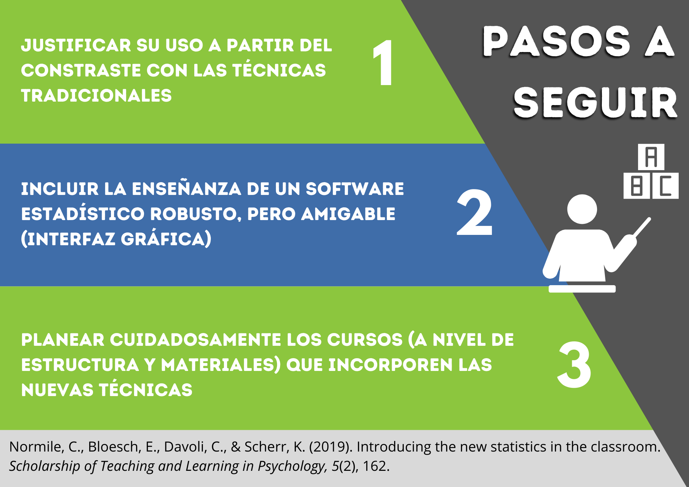

La investigación psicológica tradicionalmente se ha sostenido en el uso de técnicas relacionadas al contraste de una hipótesis alternativa frente a una nula, cuya diferencia se determina por el p-valor. Esto tiene su correspondencia en las aulas, donde la enseñanza de la estadística comienza con la *Prueba Estadística de la Hipótesis Nula* (NHST, por sus siglas en inglés), generando dificultades en los estudiantes quienes erróneamente asocian el p-valor con una significancia práctica o el efecto de una intervención.

Como alternativa, existen técnicas agrupadas bajo el paraguas de “nueva estadística”, término que no implica un desarrollo reciente, sino un creciente interés de los investigadores por utilizarlas y reportarlas en sus estudios. Tales técnicas permiten ir más allá de la decisión dicotómica del p-valor, que ha generado en los investigadores una búsqueda insistente por establecer puntos de corte. En contraste, el *tamaño del efecto* y los *intervalos de confianza* permiten explorar la magnitud de las diferencias encontradas y evaluar márgenes de error de nuestras estimaciones, respectivamente.

Normile et al. (2019) recomiendan que para introducir esta “nueva estadística” se deberían seguir los siguientes pasos:

**1. Justificar su uso a partir del contraste con las técnicas tradicionales.**
Presentándolas como un complemento más que un sustituto definitivo, y fomentando el juicio crítico hacia prácticas masivas como los puntos de corte. Además, la enseñanza de las técnicas debe orientarse a casos prácticos de la disciplina estudiada, enfatizando así su valor más allá de las aulas.

**2. Incluir la enseñanza de un software estadístico potente, pero amigable.**
Alternativas como Jamovi o JASP, con una interfaz gráfica similar al SPSS, pero que incorporan análisis robustos y recursos útiles como colocar comentarios o exportar tablas/gráficos directamente a Word. Su sencillez permite aliviar el estrés que implica manejar un nuevo software y centrarse en el aprendizaje de las técnicas en sí mismas. 

Podrán encontrar tutoriales muy completos en los siguientes enlaces:

-	Jamovi (inglés): [https://cutt.ly/4E1ljvg](https://cutt.ly/4E1ljvg){target="_blank"} / (español): [https://cutt.ly/pE1lv9A](https://cutt.ly/pE1lv9A){target="_blank"}
-	JASP (cuenta oficial): [https://cutt.ly/xE1lEnl](https://cutt.ly/xE1lEn){target="_blank"}

**3. Planear cuidadosamente los cursos que incorporen la “nueva estadística”.**
Desde la estructura del curso, manteniendo un orden lógico entre los temas y permitiendo el contraste con técnicas tradicionales; hasta la incorporación de herramientas virtuales para su explicación teórica gradual y su ejecución en software.

En conclusión, es posible incorporar las nuevas técnicas estadísticas en el aula sin perder el foco en los objetivos del curso ni agobiar a los estudiantes. Al contrario, su enseñanza se hace necesaria para preparar a los futuros profesionales en la óptima comprensión e interpretación de su campo de investigación. 

#### Referencias

Normile, C., Bloesch, E., Davoli, C., & Scherr, K. (2019). Introducing the new statistics in the classroom. *Scholarship of Teaching and Learning in Psychology*, *5*(2), 162.
[https://doi.org/10.1037/stl0000141](https://doi.org/10.1037/stl0000141){target="_blank"} 
